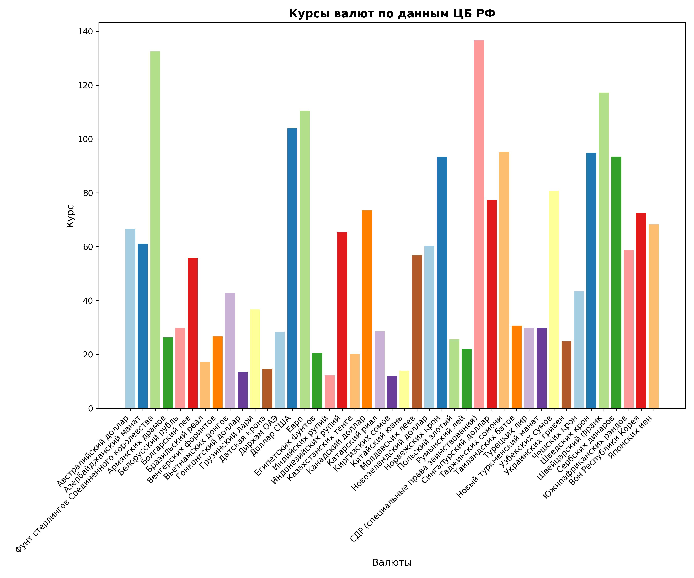
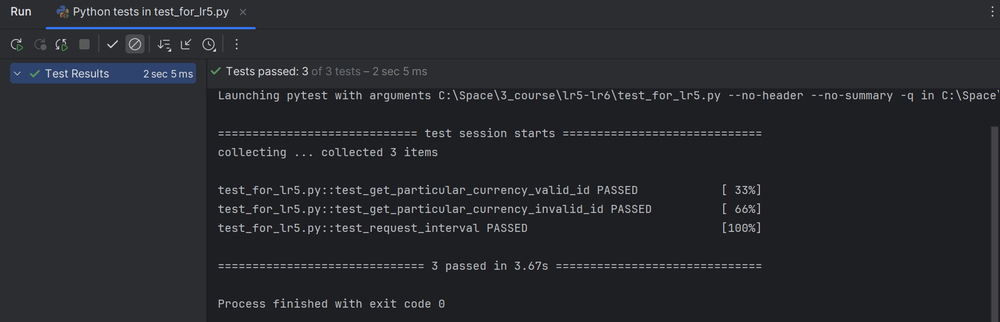
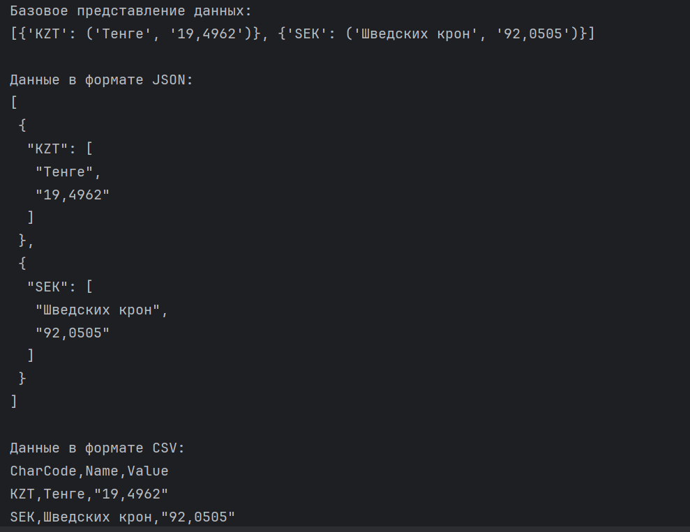

## Выполнила: Гиниятуллина Юлия Сергеевна, 2.2

# Лабораторная работа №5. Работа с валютами. Шаблон «Одиночка».
Написан код, который позволяет получать значения курсов валют с сайта ЦБ РФ в объектно-ориентированном стиле. 

Реализован шаблон проектирования "Одиночка" с помощью метаклассов. Созданы две функции: ```get_particular_currency``` для получения информации о конкретных валютах  и ```get_all_currencies``` для получения информации о всех валютах.

Также реализована визуализация списка всех валют ниже.


Результат работы тестов:



# Лабораторная работа №6. Использование шаблона «Декоратор».
Применен паттерн "Декоратор", реализована объектно-ориентированная версия программы получения курсов валют с сайта Центробанка.

Имеется возможность применить декоратор к базовой версии и получить данные в формате JSON (class ConcreteDecoratorJSON).

Имеется возможность использовать декоратор к базовой версии (CurrenciesList) или к другому декоратору (ConcreteDecoratorJSON) и получить данные в формате CSV (class ConcreteDecoratorCSV).

Результат работы программы:

